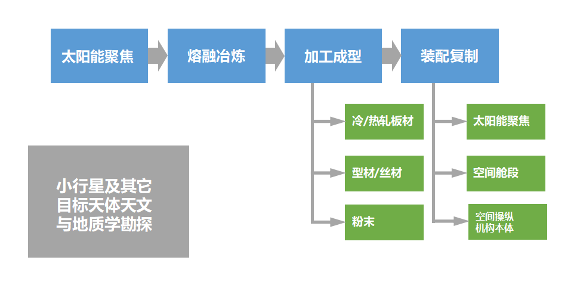

# Welcome to the EDS

I'm glad you are here. I plan to talk about the Exponential Deep Space Industries.

非正式的说，就是个深空自动化造炼钢太阳灶的

Informally speaking, it's just a project on automatically duplicate the solar furnace for steel smelting in deep space.

<!-- ## Mission & Principle

* 人类已经开始产生星球范围内大规模的影响，这标志着，封闭体系，扩展，AI与人类新的空间
* 大规模的空间工业基础是进入跨行星文明的基石
* 规模性空间工业作为进一步大科学仪器、人类在空间生活、更大规模种类工业空间化实现部分自给自足
* 尽量使用货架技术或原型经大规模验证的准货架技术

[talk given in pusoft of **from AI to space**](fromAI2Space-pusoft-talkshow-compressed.pdf)

自动化复制炼钢太阳灶 -->

## 总纲

通过如如下体系

1. 自适应光学手段
2. 对M类金属小行星等
3. 进行[太阳能聚焦矿坑熔融](https://en.wikipedia.org/wiki/Odeillo_solar_furnace)开采
4. 以及材料成型（板材/型材/打印材料）
5. 实现对自适应光学聚焦系统等结构件的规模复制（如板材反射面加电推姿态）（通过空间机械关节系统与AI工具）

达到尽量少依靠地球组件材料供应，通过初始基地包实现bootstrap可自复制大规模指数扩张深空工业的目的。

## 可展望的目标：

1. 每年翻倍，十到二十年达到百万吨级年产能的工业规模
2. 以上等效年上万间舱段的基地扩张产能
3. 接近和达到这个规模后进行更多的（可人类参与）在轨科学与工业研究，实现进一步的纯粹科学与提高组件在轨生产率目的（包括空间农业）

## 在线会议

* 指数增长自复制深空工业[第一次会议](meeting-notes/2018-09.md)

### 可能的会议议程

- [ ] 1. 所需科技树
- [ ] 2. 可行性论证
- [ ] 3. 其他潜在方案
- [ ] 4. 涉及相关学科及物色参与者
- [ ] 5. 下一次会议形式

## [科技树](tech-tree.html)

Topics in need for the exponential deep space industries

### Preliminary work

* [Target asteroids](topics/target-asteroids.md)

### Main thread

* [Solar focus](topics/solar-focus.md)
* [Smelting and forming](topics/smelting-and-forming.md)
* [Electric Propulsion](topics/space-robotics.md)

### others

* [Electric Propulsion](topics/electric-propulsion.md)

## 参考资源

* [X-type asteroid](https://en.wikipedia.org/wiki/X-type_asteroid)
* [1.5T@1MW get 550kW/T](https://detail.1688.com/offer/577804870498.html)
* [150吨电弧炉@120MVA get 1MT/yr](http://mecc.sinosteel.com/service_content.aspx?id=3327)
* [第5章电弧炉炼钢](http://www1.xpc.edu.cn/dhl/flash/4/%E7%AC%AC5%E7%AB%A0%E7%94%B5%E5%BC%A7%E7%82%89%E7%82%BC%E9%92%A2.pdf)

## Join us

* [join us](join-us.md)

---
[感谢协作单位星际移民局大力支持](https://github.com/InterImm/roundTable/issues/4)

本站总访问量次

<!-- ## Let me know several or a few

* one
* two
* ..

is this really what i'm looking for?

## How this happened?

* automatic jekyll? -->
